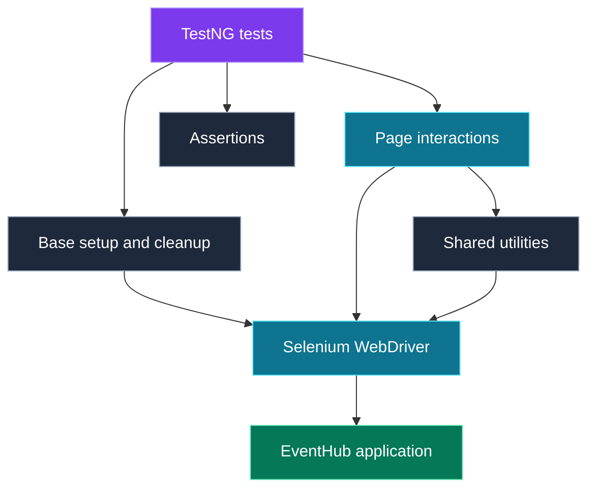

<div align="center">

# 🎟️ EVENTHUB

### Discover experiences. Book moments. Test every journey.

**Java · Selenium WebDriver · TestNG**

A mini UI automation project for **EventHub — Discover & Book Events**.


**[Overview](#overview) · [Architecture](#architecture) · [Project Structure](#project-structure) · [Run Tests](#run-tests) · [Roadmap](#roadmap)**

---

### 🔐 ACCESS &nbsp; / &nbsp; 🧭 DISCOVER &nbsp; / &nbsp; 🎫 BOOK &nbsp; / &nbsp; ⚙️ MANAGE

*An event platform explored through practical test automation.*

</div>

> **Project scope:** This README follows the package and class names visible in the project screenshot. Class responsibilities below describe the intended design. Test coverage and execution results should be confirmed against the source code before publishing.

## Overview

EventHubSelenium is my mini Java automation project for practicing browser testing with Selenium WebDriver and TestNG. The project is organized around application pages, shared utilities, a base class, and a separate test package.

The goal is to make each test easy to read, page interactions easy to maintain, and failures easy to investigate.

| 🔐 Account access | 🧭 Dashboard | 🎪 Event management |
| :--- | :--- | :--- |
| Login and registration page classes | Login dashboard and dashboard editing page classes | New-event page class |
| Focus: input validation and access | Focus: navigation and displayed information | Focus: event details and form behavior |

**Discovery and booking** are part of the product theme. Dedicated automation for these journeys is listed in the roadmap until implemented and verified.

## Architecture

The diagram shows the intended separation of responsibilities, rather than verified Java inheritance or method calls.



| Layer | Intended responsibility |
| :--- | :--- |
| **Tests** | Express scenarios and verify expected outcomes. |
| **Pages** | Keep page locators and browser interactions together. |
| **Base** | Manage shared browser setup and cleanup. |
| **Utilities** | Reuse common operations and assertion helpers. |

## Project Structure

The names and capitalization below match the supplied Eclipse screenshot.

**Project root: `EventHubSelenium/`**

| Source root | Package | Class |
| :--- | :--- | :--- |
| `src/main/java` | `org.eventhub.bases` | `EventHubBase.java` |
| `src/main/java` | `org.eventhub.common.utils` | `EventHubCommon.java` |
| `src/main/java` | `org.eventhub.pages.editDashBoard` | `EventHubEditDashboard.java` |
| `src/main/java` | `org.eventhub.pages.LoginDashboard` | `EventHubLoginDashboard.java` |
| `src/main/java` | `org.eventhub.pages.LoginPage` | `EventHubLoginPage.java` |
| `src/main/java` | `org.eventhub.pages.newEvent` | `EventHubNewEvent.java` |
| `src/main/java` | `org.eventhub.pages.RegisterPage` | `EventHubRegisterPage.java` |
| `src/main/java` | `org.eventhub.utils` | `AssertionsUtils.java` |
| `src/test/java` | `org.eventhub.tests` | `EventHubLogins.java` |

<details>
<summary><strong>📂 Build files, resources, and output folders</strong></summary>

| Item visible in Eclipse | Purpose / note |
| :--- | :--- |
| `pom.xml` | Maven project configuration and dependencies. |
| `src/resources/java` | Existing resource source folder; retain its actual configured role. |
| `src` | Physical source directory. |
| `target` | Maven-generated build output. |
| `test-output` | TestNG output folder, depending on execution settings. |
| `JRE System Library [JavaSE-27]` | Eclipse's displayed Java environment. Confirm compatibility with `pom.xml`. |
| `Maven Dependencies` | Eclipse's dependency container, rather than a repository directory. |

</details>

## Test Design

**Suggested scenario checklist — this is a plan, not a claim of completed coverage.**

| Area | Positive path | Negative / boundary checks |
| :--- | :--- | :--- |
| 🔐 Login | Valid user reaches the expected dashboard | Blank email, blank password, invalid credentials |
| 📝 Registration | Valid details create an account | Invalid email, password rules, confirmation mismatch |
| 🧭 Dashboard | Expected user information and links appear | Navigation failures and unexpected displayed values |
| ✏️ Edit dashboard | Valid updates persist after refresh | Required fields and invalid input |
| 🎪 New event | Valid event details are accepted | Missing details and date/time validation |
| 🎫 Booking — planned | User books an available event | Availability limits and duplicate submissions, if supported |

### Example scenario

```gherkin
Given a user is on the EventHub login page
When the user submits an empty email and a valid password
Then the email validation message should be displayed
And the user should remain on the login page
```

*This is a readable scenario description; Cucumber is not required or claimed as part of this project.*

## Run Tests

### 1. Prepare the environment

- Install a JDK compatible with the project's `pom.xml`. The screenshot shows JavaSE-27 in Eclipse.
- Install Maven and the browser configured in the project.
- Set the application URL and test credentials wherever the current framework reads them.
- Use a test account; keep passwords and other secrets out of the repository.

Check your local tools:

```bash
java -version
mvn -version
```

### 2. Run the visible test class

From the folder containing `pom.xml`:

```bash
mvn clean test -Dtest=EventHubLogins
```

This command assumes Maven Surefire is configured to execute TestNG tests and the project compiles successfully.

> `EventHubLogins` does not match the usual default Surefire test-class naming patterns. Use the explicit command above, or configure Surefire includes / a TestNG suite before relying on `mvn clean test` alone.

### 3. Run from Eclipse

1. Import the repository as an **Existing Maven Project**.
2. Confirm the project JDK and update Maven dependencies.
3. Open `EventHubLogins.java`.
4. Select **Run As → TestNG Test** with TestNG support installed.

<details>
<summary><strong>⚙️ Optional Maven discovery configuration</strong></summary>

If Surefire already exists in `pom.xml`, merge this configuration into its existing plugin entry. Avoid adding a duplicate plugin. Keep a compatible, explicitly pinned plugin version in your project.

```xml
<configuration>
    <includes>
        <include>**/EventHubLogins.java</include>
    </includes>
</configuration>
```

Alternatively, rename the class and file to `EventHubLoginsTest` and update any references or suite entries.

</details>

## Results & Evidence

| Execution route | Where to look |
| :--- | :--- |
| Maven Surefire | `target/surefire-reports/`, when generated |
| Eclipse / TestNG | TestNG results view and configured `test-output/` files |
| Screenshots | The directory configured by your screenshot utility, if implemented |

**Publish measured results after a real run.** Include the execution date, environment, tests passed / failed / skipped, and any known defects. A passing badge should reflect an actual automated workflow.

<!-- OPTIONAL SCREENSHOT GALLERY
Add real screenshots at these repository paths, then remove this comment wrapper.
Do not publish credentials, personal information, or fabricated test results.

### Application Preview

| Login | Dashboard |
| :---: | :---: |
|  |  |

### Execution Evidence


END OPTIONAL SCREENSHOT GALLERY -->

## Roadmap

- [ ] Verify and document the login and registration scenarios.
- [ ] Add data-driven validation with TestNG `@DataProvider`.
- [ ] Capture screenshots automatically on test failure.
- [ ] Verify event creation and dashboard updates.
- [ ] Add event discovery and booking tests.
- [ ] Externalize environment settings and test credentials.
- [ ] Configure repeatable Maven test discovery.
- [ ] Add a CI workflow and a real build-status badge.

## Learning Focus

**Readable scenarios. Reusable page actions. Reliable verification.**

This project is a place to practice Java automation design, locator selection, synchronization, assertions, and failure investigation through a focused event-platform example.

## README References

- [Best-README-Template](https://github.com/othneildrew/Best-README-Template) — a reference for common project documentation sections.
- [GitHub diagram documentation](https://docs.github.com/en/get-started/writing-on-github/working-with-advanced-formatting/creating-diagrams) — Mermaid rendering in Markdown.
- [Shields.io](https://shields.io/) — technology badges used in this README. Badge images require network access.

---

<div align="center">

### Built with curiosity. Improved through testing.

**Sasikiran Kakara · Test Engineer**  
**TechWithSasikiran**

*Learning in public, one test at a time.*

[↑ Back to top](#-eventhub)

</div>
